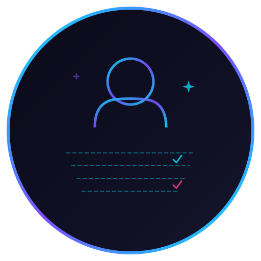

# synthux

**AI-powered UX audit in your browser. Open source.**

<p align="center">
  
</p>

<p align="center">
  <a href="https://synthux.app">Website</a> ·
  <a href="docs/getting-started.md">Documentation</a> ·
  <a href="docs/CONTRIBUTING.md">Contributing</a> ·
  <a href="https://github.com/synthuxapp/synthux/issues">Issues</a>
</p>

---

## ✨ What is synthux?

synthux is an open-source Chrome extension that evaluates web pages using **synthetic user profiles** and **Nielsen's 10 Usability Heuristics** — powered by local AI (Ollama).

No data leaves your machine. No API costs. No signup.

## 🚀 Features

- 🤖 **Local AI Analysis** — Ollama + Gemma 3/4, runs entirely on your machine
- 📋 **Nielsen's 10 Heuristics** — Industry-standard UX evaluation framework
- 👥 **Synthetic User Profiles** — First-time visitor, power user, accessibility user
- ♿ **Automated Accessibility Audit** — WCAG contrast, alt text, heading structure, landmarks
- 📊 **Detailed Scoring** — 0-100 scores per heuristic with actionable recommendations
- 🔓 **100% Private** — Your data never leaves your machine
- 📝 **Markdown Export** — Copy reports to Notion, GitHub Issues, or any markdown editor
- ⚡ **Quick & Deep Modes** — Fast 3-heuristic scan or full 10-heuristic analysis

## 📦 Quick Start

### 1. Install Ollama

```bash
# macOS
brew install ollama

# Or download from https://ollama.com
```

### 2. Pull a Model

```bash
ollama pull gemma3
# or
ollama pull gemma3:12b  # Higher quality, needs more RAM
```

### 3. Start Ollama (with Chrome extension support)

```bash
# Required: Allow Chrome extension to communicate with Ollama
export OLLAMA_ORIGINS="*"
ollama serve

# Add to ~/.zshrc for persistence:
echo 'export OLLAMA_ORIGINS="*"' >> ~/.zshrc
```

### 4. Install Extension

- Clone this repo: `git clone https://github.com/synthuxapp/synthux.git`
- Open Chrome → `chrome://extensions`
- Enable "Developer mode"
- Click "Load unpacked" → Select the `extension/` folder
- Click the synthux icon → Side Panel opens

### 5. Analyze!

1. Navigate to any website
2. Open synthux Side Panel
3. Select profiles and analysis mode
4. Click **"Analyze Page"**
5. View results and export as Markdown

## 🏗️ Architecture

```
Extension (Chrome Side Panel)
    ↕ messages
Service Worker (Background)
    ↕ fetch
Content Script (DOM Extraction) ←→ Active Page
    ↕
Ollama (localhost:11434) ←→ Gemma 3/4 Model
```

- **Content Script** extracts DOM structure, accessibility data, navigation, and content metrics
- **Service Worker** orchestrates analysis: scanning → screenshot → AI evaluation → report
- **Side Panel** (Lit Web Components) provides premium dark-themed UI for control and viewing
- **Ollama** runs locally, processing heuristic evaluations with synthetic user personas

## 🧩 Project Structure

```
synthuxapp/
├── extension/                  # Chrome Extension (load this in Chrome)
│   ├── manifest.json           # Manifest V3
│   ├── background/             # Service Worker
│   ├── content/                # Page scanning content script
│   ├── sidepanel/              # Side Panel UI (HTML + CSS + bundled JS)
│   ├── core/                   # Business logic modules
│   ├── rules/                  # Heuristic rule definitions (JSON)
│   ├── assets/                 # Icons and logo
│   └── _locales/               # i18n (en, tr)
├── src/                        # Source code (Lit components)
│   └── sidepanel/
│       ├── app.js              # Root component
│       └── components/         # Scanner, Report, Settings, Score
├── website/                    # Landing page (synthux.app)
└── docs/                       # Documentation
```

## 🛠️ Development

```bash
# Install dependencies
npm install

# Build Side Panel bundle
npm run build

# Watch mode (auto-rebuild on changes)
npm run dev

# Lint extension
npm run lint:ext

# Code formatting
npm run format
```

After building, load the `extension/` folder in Chrome as an unpacked extension.

## 🌍 Supported Languages

- 🇬🇧 English (default)
- 🇹🇷 Türkçe

## 🤝 Contributing

We welcome contributions! See [CONTRIBUTING.md](docs/CONTRIBUTING.md) for guidelines.

**Ways to contribute:**
- 🐛 Report bugs
- 💡 Suggest features
- 📋 Add new heuristic rule sets (e.g., e-commerce, SaaS)
- 🌍 Add translations
- 📖 Improve documentation

## 📄 License

[MIT License](LICENSE) — free to use, modify, and distribute.

## 🔮 Roadmap

- [x] MVP: Chrome Extension + Ollama + Nielsen 10 Heuristics
- [ ] BYOK API Key support (OpenAI, Gemini, Claude)
- [ ] PDF report export
- [ ] WCAG full audit module
- [ ] Custom synthetic profiles
- [ ] Competitor comparison (2 URLs side by side)
- [ ] Figma plugin version
- [ ] Sectoral rule packs (e-commerce, fintech, SaaS)

---

<p align="center">
  Made with 🧠 by <a href="https://github.com/synthuxapp">synthuxapp</a>
</p>
